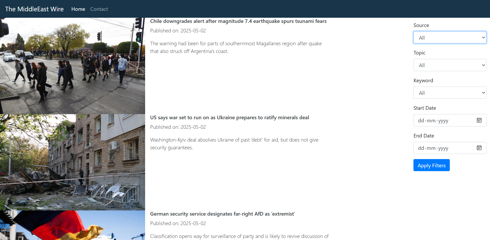
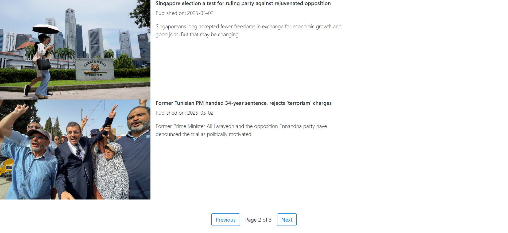
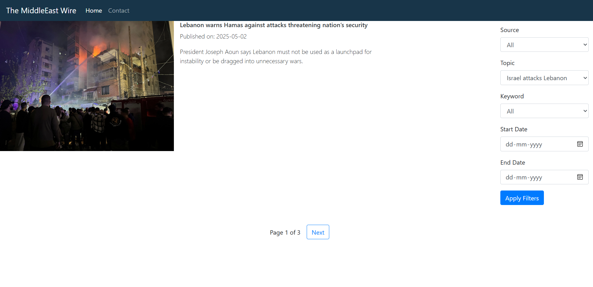

## The MiddleEast Wire: A Web Scraping-Powered News Aggregator

### Table of Contents
- [Overview](#overview)
- [Data Source](#data-source)
- [Tech Stack](#tech-stack)
- [Run the Project](#run-the-project)
- [Application Preview](#application-preview)

### Overview 

The MiddleEast Wire is a curated collection of the latest news articles from around the world, with a strong focus on the Middle Eastern coverage. It extracts content from leading sources like <i>The Middle East Eye</i> and <i>Al Jazeera</i>, presenting them in a clean, searchable interface.

### Data Source

[Al Jazeera News](https://www.aljazeera.com/news)
<br>
[Middle East Eye](https://www.middleeasteye.net/)

### Tech Stack 


### Run the project

1. Create a py venv.

```bash 
py -3 -m venv .venv
```

2. Activate the venv

```bash 
source venv/Scripts/activate
```

3. Install Flask with pip 

```bash 
pip install -r requirements.txt
```

4. Run the flask application

```bash
py newsapp.py 
```

### Application Preview 

A responsive Flask web application displaying news articles from the Middle East, featuring Source, Topic, Keyword and Date filters, along with paginated results.





